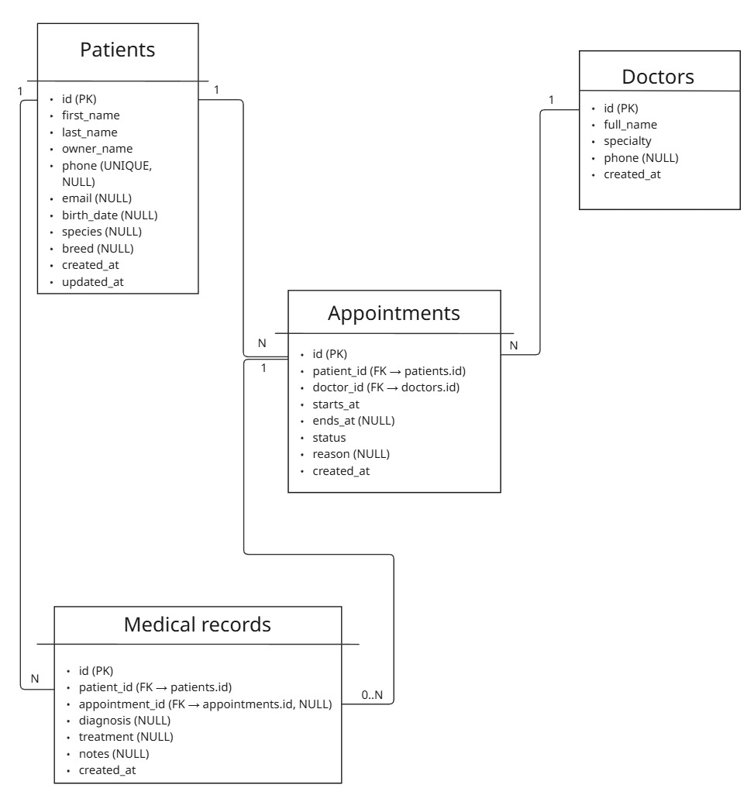

# Ветеринарная клиника (FastAPI)

Небольшое приложение “Ветеринарная клиника” на Python.

### Схема БД


### 1) Новый пациент 
- Добавление пациента через UI и API
- Просмотр списка пациентов
- Просмотр пациента по ID
- Редактирование пациента
- Удаление пациента

UI открывается сразу на главной странице:
- http://127.0.0.1:8000/ (список пациентов + форма добавления)

### 2) Запись к врачу (описано в схеме БД)
- Таблица appointments предусмотрена
- Связи пациент <-> врач <-> запись предусмотрены

### 3) Медицинские карточки (описано в схеме БД)
- Таблица medical_records предусмотрена
- Карточка привязана к пациенту

---

## Технологии

- **Python 3.12**
- **FastAPI**
- **Uvicorn**
- **SQLAlchemy 2.0**
- **SQLite** 
- **Pydantic** 
- **Jinja2** 
- **python-multipart**

---

## Установка и запуск

1) Установить зависимости:
```bash
pip install -r requirements.txt
```

2) Запустить сервер:
```bash
uvicorn main:app --reload
```

3) Открыть:
- UI: http://127.0.0.1:8000/
